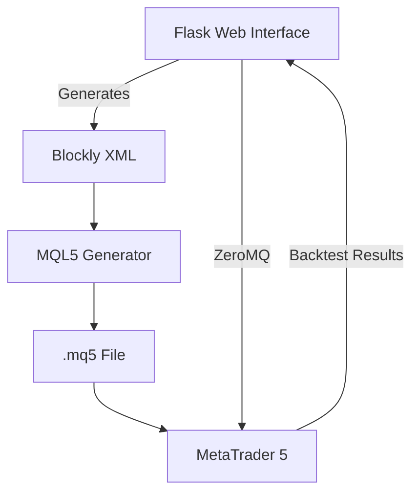

# Expert Advisor Builder with Flask and MQL5

  
*A visual programming interface for creating MetaTrader 5 Expert Advisors*

## Table of Contents
- [Features](#features)
- [Demo](#demo)
- [Installation](#installation)
- [Usage](#usage)
- [Architecture](#architecture)
- [Customization](#customization)
- [Backtesting](#backtesting)
- [Deployment](#deployment)
- [Contributing](#contributing)
- [License](#license)

## Features ✨

✅ **Drag-and-Drop Interface**  
Build trading strategies visually without coding using Blockly-based editor

✅ **Real MQL5 Code Generation**  
Produces production-ready Expert Advisors compatible with MetaTrader 5

✅ **Advanced Trading Components**:
- 50+ built-in technical indicators
- Custom indicator creation
- Range detection (support/resistance)
- Volatility-based position sizing
- Time-based trading filters

✅ **Risk Management Tools**:
- Stop loss/take profit calculators
- Percentage-based risk calculation
- Maximum position limits
- Trailing stop functionality

✅ **Backtesting Integration**  
Test strategies directly against historical data

✅ **MT5 Live Connection**  
Deploy strategies to your MetaTrader 5 terminal via ZeroMQ

## Demo 🎥

[](https://example.com/demo)

## Installation ⚙️

### Prerequisites
- Python 3.8+
- MetaTrader 5 terminal
- ZeroMQ library

### Setup

1. **Clone the repository**:
   ```bash
   git clone https://github.com/yourusername/ea-builder.git
   cd ea-builder
   ```

2. **Install Python dependencies**:
   ```bash
   pip install -r requirements.txt
   ```

3. **Configure MT5 ZeroMQ Server**:
   - Copy `mt5_zeromq_server.mq5` to your MT5 Experts folder
   - Compile and attach to any chart

4. **Set environment variables**:
   ```bash
   export FLASK_SECRET_KEY=your-secret-key
   export MT5_SERVER_ADDRESS=tcp://localhost:5555
   ```

## Usage 🚀

1. **Start the Flask server**:
   ```bash
   python app.py
   ```

2. **Access the web interface**:
   ```
   http://localhost:5000
   ```

3. **Build your strategy**:
   - Drag indicators and trading logic blocks
   - Configure parameters
   - Preview generated MQL5 code

4. **Export your EA**:
   - Download .mq5 file directly
   - Send to MT5 terminal for live trading
   - Run backtests from the web interface

## Architecture 🏗️



**Key Components**:
- **Frontend**: Blockly-based visual editor + Chart.js visualization
- **Backend**: Flask server with MQL5 generation engine
- **MT5 Bridge**: ZeroMQ communication layer
- **Database**: SQLite/PostgreSQL for strategy storage

## Customization 🛠️

### Adding New Indicators

1. Create a new Blockly block in `static/js/mt5_blocks.js`:
   ```javascript
   Blockly.Blocks['indicator_mycustom'] = {
     init: function() {
       // Block configuration
     }
   };
   ```

2. Add the MQL5 generator in `mql5_generator.py`:
   ```python
   def _generate_mycustom_indicator():
       return """
   double MyCustomIndicator() {
       // Implementation
   }
   """
   ```

### Modifying Trading Logic

Edit the template structures in:
- `_generate_tick_code()`
- `_generate_helper_functions()`

## Backtesting 📊

The system supports three backtesting methods:

1. **Quick Test**: Runs in the browser using simplified models
2. **MT5 Local Backtest**: Sends strategy to your MT5 terminal
3. **Cloud Backtest**: (Premium) Runs on high-performance servers

To run a local backtest:
1. Build your strategy
2. Click "Backtest" button
3. Select date range and parameters
4. View detailed results and equity curve

## Deployment 🌐

For production deployment:

1. **Recommended Stack**:
   - Web Server: Nginx + Gunicorn
   - Database: PostgreSQL
   - Task Queue: Redis + Celery

2. **Docker Setup**:
   ```bash
   docker-compose up -d
   ```

3. **Configuration**:
   - Set `ENVIRONMENT=production`
   - Configure HTTPS
   - Set up proper authentication

## Contributing 🤝

We welcome contributions! Please follow these steps:

1. Fork the repository
2. Create your feature branch (`git checkout -b feature/AmazingFeature`)
3. Commit your changes (`git commit -m 'Add some AmazingFeature'`)
4. Push to the branch (`git push origin feature/AmazingFeature`)
5. Open a Pull Request

## License 📄

This project is licensed under the MIT License - see the [LICENSE](LICENSE) file for details.

---

**Disclaimer**: This software is for educational purposes only. The developers are not responsible for any financial losses incurred from using trading strategies generated by this system. Always test strategies thoroughly before live deployment.